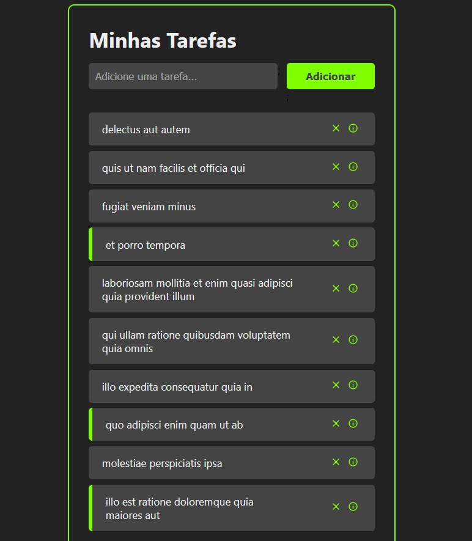

# Task list
Update and delete items from a task list and create a simple CRUD (Create, Read, Update, and Delete) application. 

### Features

- [x] useState
- [x] useEffect 
- [x] React components
- [x] Props
- [x] react-router-dom
- [x] API request

### 🛠️ Set up

Clone it and run ```npm install```
Then ```npm start```

<p align="center">
  
</p>
